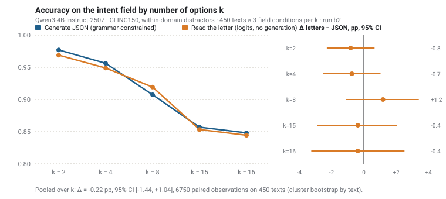
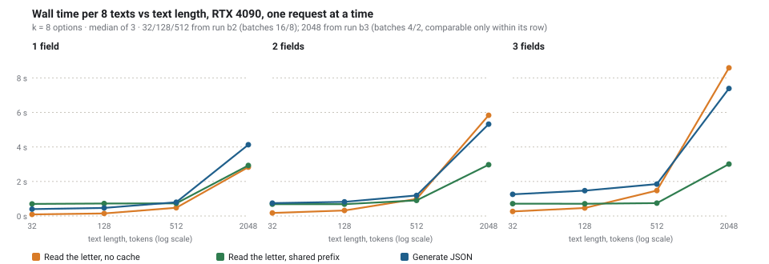
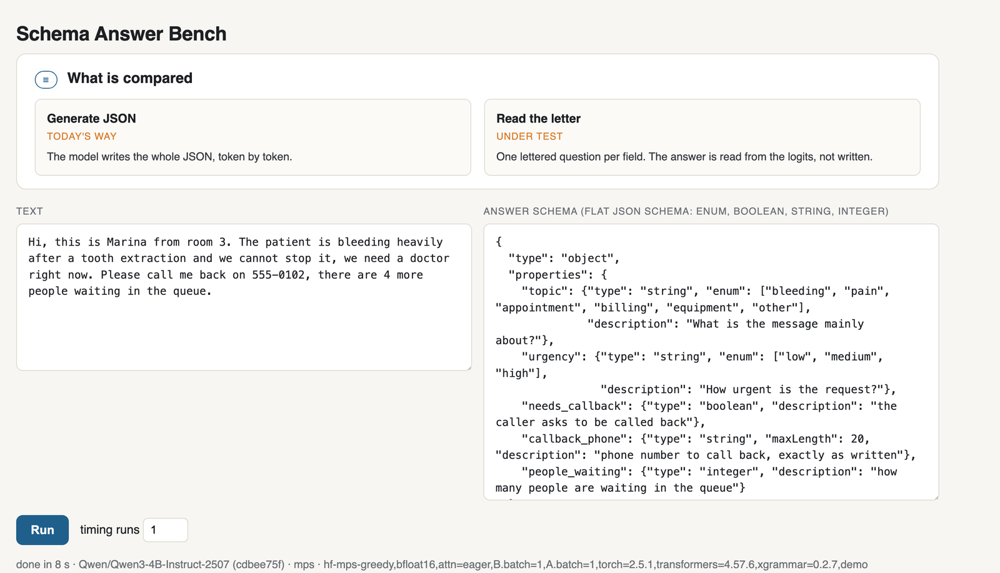
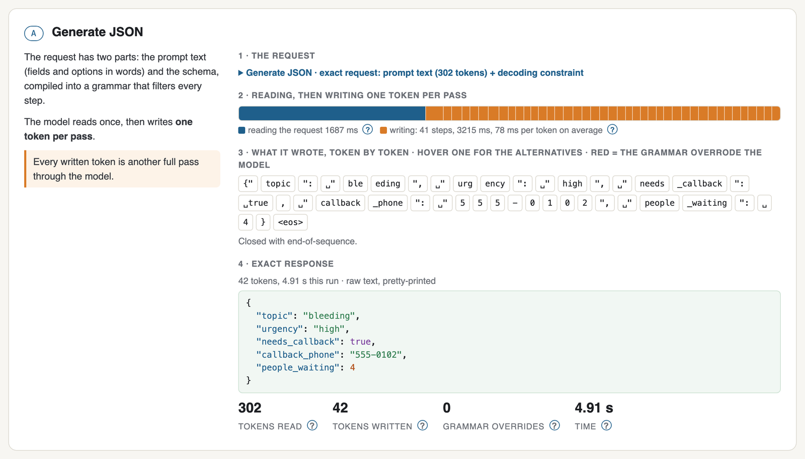
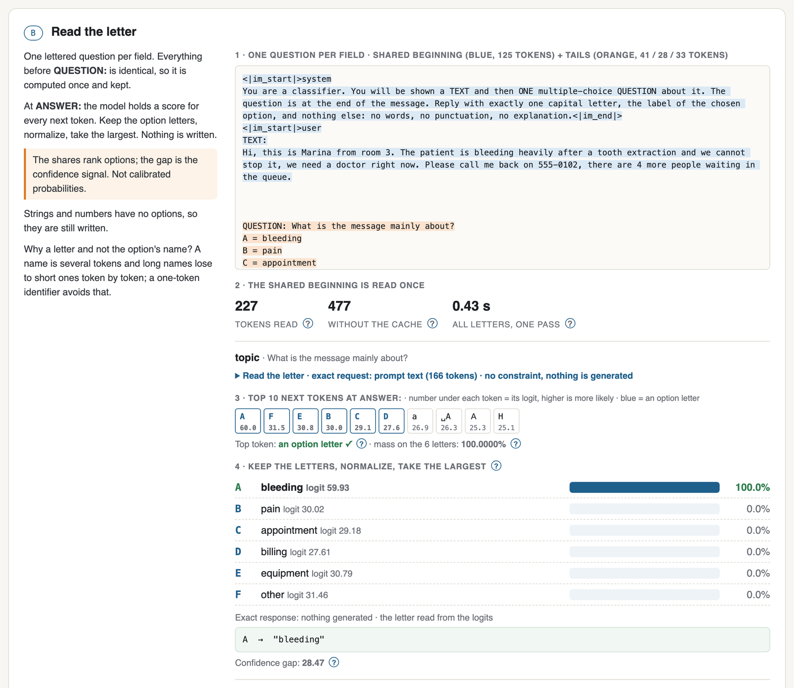
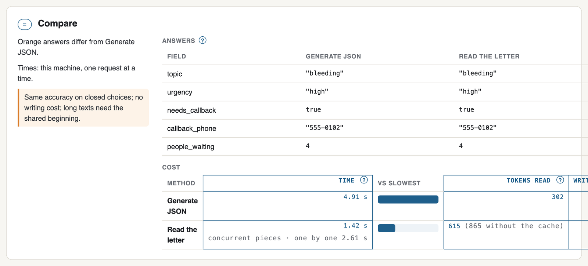

# mini-Jev · read the letter

**What a Jev-style interface looks like on a frozen model: classify against a schema that arrives with the request by reading next-token logits, not by generating JSON. Measured on Qwen3-4B.**

TypeSafe's [Jev](https://typesafe.ai) is trained for typed decisions without open generation. mini-Jev asks how much of that interface an ordinary frozen model already provides, and measures it against today's path, grammar-constrained JSON.

A JSON schema arrives with the request. Today the model *writes* a JSON object under a grammar, token by token. This project measures the alternative for closed-choice fields: turn each field into a lettered multiple-choice question, run one forward pass, and **read the model's scores for the option letters** at the answer position. No token is generated. Strings and numbers are still generated.

Everything here runs on `Qwen/Qwen3-4B-Instruct-2507` (bf16, greedy) with [xgrammar](https://github.com/mlc-ai/xgrammar) for constrained generation and [CLINC150](https://huggingface.co/datasets/clinc/clinc_oos) as the task. The experiment was preregistered (`PREREG.md`, amendments v1.1–v1.3) and every number below is recomputed from the stored run records.

## Results in one table

| question | answer | evidence |
|---|---|---|
| Does reading the letter lose accuracy vs generating JSON under a grammar? | **No.** Intent field, 6750 paired observations on 450 texts: JSON 0.909, letters 0.907, Δ −0.22 pp, 95 % CI [−1.44, +1.04]. Every k from 2 to 16 has a CI covering zero. | run b2, [figure](docs/figures/accuracy_by_k.svg) |
| Is the mechanism really reading the answer? | Yes. The most likely next token is an option letter in 13 600 / 13 600 questions; the letters carry the whole distribution (candidate mass min 0.99999624); position prior is flat; the unconstrained model writes the same letter we read in 199 / 200 prompt-identical controls. | run b2 |
| Is it faster? | **4× faster** than JSON on short texts (32 tokens: 0.24× the time). On 2048-token texts **1.4× / 1.8× / 2.4× faster** for 1 / 2 / 3 fields with the shared-prefix cache (the text's KV cache reused across the questions; 0.71 / 0.56 / 0.41× the time). The naive form that re-reads the text per field loses there (1.10–1.16×). | runs b2/b3, [figure](docs/figures/cost_by_length.svg) |
| Is a letter better than writing the option's name? | Yes: +10.0 pp [+8.3, +11.7] for the letter on intent, +13.2 pp on domain, +1.2 pp (CI covers 0) on a boolean whose names are already single tokens. | run b1, [figure](docs/figures/symbol_vs_label.svg) |
| Where does reading lose? | Out-of-scope texts: JSON picks "none of the above" on 47 / 50, letters on 41 / 50 (both 1 / 50 on in-scope texts). Dependent fields: a boolean that follows from an earlier field gains 5 pp when written after it in one JSON. | run b2, [figure](docs/figures/out_of_scope.svg) |
| Should the model write probabilities instead (the TypeSafe adapter shape)? | No. With a bounded enum grid and a 640-token cap the form finishes but scores 0.346 on intent vs 0.896 for letters on the same units; 62 % of its "choices" are the first option. | run b3 |
| Does a shared KV cache change the answers? | Same accuracy (0.8484 vs 0.8483); 59 / 13 500 answers flip, all near ties, consistent with a different arithmetic path. The same code on two different RTX 4090s is bit-identical (607 / 607). | run b2 |





## What to do with each kind of field

| field type | recommended | why | watch out |
|---|---|---|---|
| **enum, 2–26 options** | ask a lettered question, read the letter scores (or generate one letter under a grammar; it is the same decision) | same accuracy as JSON, no decode cost, a ranking over options plus a confidence gap for free | the shares are *normalized candidate scores*, not calibrated probabilities; use the gap for abstention, do not read the percentage as P(correct) |
| **boolean** | letter read (`A = true, B = false`) when independent; keep it inside one JSON, or put the earlier answer into the question, when it depends on another field | independent booleans read fine (0.95); a dependent one lost 5 pp when read alone | the length advantage of letters is nil here: `true`/`false` are already single tokens |
| **"none of the above" / abstention** | keep JSON generation, or read letters and add an explicit abstention rule on the gap | reading picked "none" less often on out-of-scope texts (41 vs 47 of 50) | 50 texts: a direction, not a measured size |
| **enum with > 26 options** | two-level codes (`A1`…) or hierarchical questions | not measured here | out of scope of this study |
| **string copied from the text** (phone, date, name, quote) | first try to make it a choice: enumerate the candidates found in the text (regex or a tagger for phones, dates, numbers, names; numbered sentences for quotes) and ask "which one?" with letters; the model then cannot alter the copied span. Generate under a single-field grammar with `maxLength` only when candidates cannot be enumerated | a closed set of spans reads like any enum; a copied span is never corrupted | extraction-as-choice is a recommendation from the design, not measured in this study |
| **integer / number** | generate under a grammar with a bounded type (`integer`, or an enum grid of allowed decimals) | an unbounded `number` accepts an endless digit string | never ask the model to write probabilities as numbers: 0.35 accuracy |
| **free text** | generate | nothing to read | — |
| **many fields on one long text** | read letters with a shared prefix (server-side prefix caching does this for you) | re-reading a 2048-token text per field costs more than one JSON; the cache brings it back to 0.4–0.7× | the shared part must be byte-identical: put the question *after* the text |

In TypeSafe's own vocabulary ([agent skill](https://docs.typesafe.ai/agent-skill)): their **Choice** and **Noul** primitives are what this study measures on a frozen model, as the letter read and the boolean; **Score** (an ordered scale) was not measured; their pattern *select over generate* is the extraction-as-choice recommendation above, also not measured here. This is a correspondence of terms, not a reproduction of their model.

Rule of thumb from the whole study: **on this model, quality is the same either way for closed choices; the single lever that changed accuracy was giving the model a one-token identifier to answer with.** Reading the logits then removes the decode cost and hands you a distribution.

## Try it: the teaching bench

`demo/` is a local page that takes a text and a flat JSON schema, answers it with both methods on one model, and shows every step with the model's own numbers: the exact prompt and constraint, the top next tokens at the answer position, the letter scores, what the grammar allowed and overrode at each written token, and the timing.

Requirements: Python 3.11, [uv](https://docs.astral.sh/uv/), ~9 GB of disk for the weights, and either Apple Silicon (MPS) or an NVIDIA GPU (CUDA). The 4B model needs about 8.5 GB of memory.

```bash
git clone https://github.com/r-ms/mini-jev.git && cd mini-jev
uv sync                                   # torch 2.5.1, transformers 4.57.6, xgrammar 0.2.7, pinned
MINIJEV_DEVICE=mps uv run python demo/server.py    # or MINIJEV_DEVICE=cuda
# first start downloads Qwen/Qwen3-4B-Instruct-2507 (revision pinned) and warms up, then:
open http://127.0.0.1:8765/
```

Edit the text or the schema in the page and press **Run**. Supported field types: `string` with `enum`, `boolean`, `string` (with `maxLength`), `integer`, `number`. Nested objects and arrays are refused on purpose.

What you will see, on the default example:









Hover any written token in the page to see the five tokens the model considered at that step, which of them the grammar blocked, and the best tokens it allowed.

## Reproduce the experiment

```bash
uv run python scripts/build_data.py                    # CLINC150 sample, pinned revision, manifest with hashes
MINIJEV_DEVICE=cuda uv run python scripts/smoke_positions.py      # two-sided guard for the generation path
MINIJEV_DEVICE=cuda uv run python scripts/run.py --arm B1      --subset main --run-id r1
MINIJEV_DEVICE=cuda uv run python scripts/run.py --arm A1joint --subset main --run-id r1
uv run python scripts/report.py runs/r1                # mechanism counters first, then accuracies
uv run python scripts/run_cost.py --run-id r1 --lengths 32,128,512
uv run python analysis/figures.py                      # redraws docs/figures from runs/
uv run pytest -q tests/                                # 29 harness guards (each has a placebo)
```

Arms: `B1` (read letters), `B1cache` (read letters on a shared prefix), `A1joint` (one JSON, all fields), `A1split` (one JSON per field), `A1letter` (one letter under a grammar), `A1label` (option name under a grammar), `A1prob` (model writes probabilities), `A0` (no grammar), `B1free` (unconstrained text control), `B1perm` (option-order rotation), plus `scripts/run_score.py` for sequence likelihood of the names. Every record carries the raw response, candidate logits, prompt and schema hashes, the gold position and a run-mode string; a run refuses to resume if the mode changed.

## Repository layout

**Run records on the Hub:** [`Mikhail/mini-jev-runs`](https://huggingface.co/datasets/Mikhail/mini-jev-runs) — 27 900 decisions with full candidate logits, normalized scores, confidence gaps and provenance hashes. Enough to study calibration and abstention rules without a GPU.

```
README.md            this file
docs/ARTICLE.md      the write-up, with figures
PREREG.md            preregistration and its four amendments (v1 … v1.3)
DEFERRED.md          what was deliberately not done (second model, calibration)
minijev/             engine, prompts, schema and grammar builders, scoring, report
scripts/             run.py (all arms), run_cost.py, run_score.py, smoke_*.py, report.py, build_data.py
analysis/            follow-up analyses (dependent fields, controls) and figures.py
demo/                the teaching bench: server.py + index.html
tests/               29 guards for the harness
runs/                run records (not committed; regenerate, or take them from the Hub dataset above)
```

## Caveats, stated plainly

One model (Qwen3-4B-Instruct), one dataset (CLINC150, English, short utterances). Bench times are one request at a time on one GPU. The letter shares are a ranking with a confidence gap, not calibrated probabilities.

## License

MIT. CLINC150 is © its authors under CC BY 3.0; Qwen3 weights are under the Apache-2.0 license of their release.
