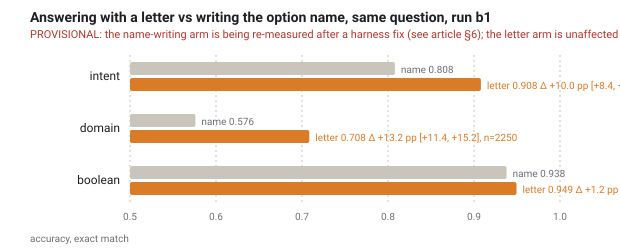
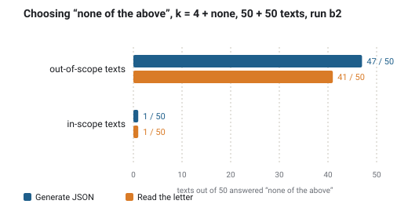

# mini-Jev: classification without generation, reading letter logits against grammar-constrained JSON on one Qwen3-4B

*Technical note, 2026-09-17. Preregistration: `PREREG.md` (v1 → v1.3).*

> **Status.** On the day this draft was assembled, a harness defect was found in the generation path (§6). Reading arms are unaffected. Numbers that come from a multi-token generation arm are marked **provisional** and are being re-measured with the fixed engine; the decision rules for what survives were written down before the re-run was read (PREREG v1.3).

## Abstract

A frozen instruction model can take a label schema that arrives with the request, turn each closed-choice field into a lettered question, and answer it by **reading its next-token scores for the option letters** instead of generating anything. On CLINC150 with Qwen3-4B-Instruct-2507 this keeps the accuracy of grammar-constrained JSON generation (Δ −0.22 pp, 95 % CI [−1.44, +1.04], 6750 paired observations on 450 texts), removes the decode cost (0.24× the time of JSON on short texts), and needs a shared prefix (KV cache of the text reused across questions) to keep the advantage on long texts. The lever that changed accuracy was not reading versus writing but **answering with a one-token identifier instead of the option's name** (provisional: +10 pp). Reading loses where the model must say "none of these" and where one field depends on another. The model's own attempt to *write* probabilities per option is far worse than either (provisional: 0.35 vs 0.90).

## 1. The question

Structured decisions are obtained today by writing: the model emits a JSON object token by token while a grammar removes every continuation that would break the schema. The format is guaranteed, the decode steps are paid, and the model's uncertainty has to be reconstructed from side data. TypeSafe's Jev is advertised as a model trained for a different interface: no open generation, typed distributions as the native output, independent decisions in parallel. We asked the adjacent question: **how much of that interface does an ordinary frozen model already provide?** Unroll the schema into questions, name the options with single tokens (letters), run one forward pass, read k numbers at the answer position.

Out of scope by decision (`DEFERRED.md`): calibration of the normalized scores, a second model, k > 26, vLLM and production latency.

## 2. Setup

**Model.** `Qwen/Qwen3-4B-Instruct-2507`, revision `cdbee75f`, bf16, greedy, eager attention, HF transformers 4.57.6, xgrammar 0.2.7. Candidate letter scores are recomputed in fp32 from the last hidden state (the bf16 grid step at logit magnitude 16–32 is 0.125, which would turn near ties into a position bias); the model's own bf16 head decides greedy generation. The two agree on the argmax over the k letters in 13 595 / 13 600 questions; the five disagreements are all at fp32 gaps ≤ 0.15.

**Data.** CLINC150 (`plus` / `test`, pinned revision): 450 in-scope texts, 3 per intent, all 150 intents, plus 50 out-of-scope texts. Distractors are drawn **within the intent's domain** (the hard condition: `pay_bill` vs `bill_balance` vs `min_payment`), k ∈ {2, 4, 8, 15} and k = 16 with one cross-domain filler. Fields: `intent` (k-way), `domain` (10-way), and one boolean; field conditions f ∈ {1, 2, 3}. Option sets are seeded per (text, field, k) and reused across arms, so every comparison is paired.

**The ladder.** Adjacent rungs differ in one thing.

| arm | how it answers | isolates |
|---|---|---|
| `A1joint` | one JSON with all fields, values are the option names, xgrammar | today's path |
| `A1split` | one JSON per field | together vs apart |
| `A1label` | multiple-choice prompt, grammar over the k option **names** | name vs letter (same prompt) |
| `A1letter` | multiple-choice prompt, grammar over the k **letters**, one token | the same decision as B1, generated |
| `B1` | same prompt, **read** the k letter logits, nothing generated | the method under test |
| `B1cache` | B1 with the text prefilled once and its KV cache broadcast to the questions | cost of re-reading |
| `B1score` | teacher-forced sequence likelihood of the option names (LMQL-style) | scoring whole names |
| `A1prob` | the model writes a probability per option under a JSON schema (TypeSafe's published adapter shape) | their baseline form |
| `A0`, `B1free`, `B1perm` | no grammar; unconstrained text control; option-order rotation | binding, reading, position prior |

**Controls with an operand outside the mechanism.** Oracle engines through the real pipeline (gold-piked logits must score 1.0, next-position-piked must score 0.0); a mutation that records the gold position before shuffling must turn the oracle red; the unconstrained model's *written* letter compared with the *read* letter on byte-identical prompts; a placebo for every harness guard (29 tests). Join keys are proven unique before any aggregation (37 150 / 37 150 in run b2).

## 3. Results

### 3.1 The mechanism fires

The unconstrained argmax at the answer position is one of the option letters in 13 600 / 13 600 questions across all 15 (k, f) cells. The k letters carry the whole next-token distribution: candidate mass minimum 0.99999624, first percentile and median 1.00000000. The position prior on real texts is flat (k = 4: 0.275 / 0.245 / 0.240 / 0.240 against 0.250; k = 8: within 0.005 of 0.125). With no grammar at all, the model writes the letter we read in 199 / 200 prompt-identical controls; the one exception is a near tie.

### 3.2 Accuracy: parity with grammar-constrained JSON

Intent field, hard grid, all k, run b2: JSON 0.9092, letters 0.9070, **Δ −0.22 pp, 95 % CI [−1.44, +1.04]**, 6750 paired condition-observations on 450 unique texts, cluster bootstrap by text, discordant 210 vs 225. Per k the deltas are −0.81 / −0.74 / +1.19 / −0.37 / −0.37 pp and every interval covers zero. The preregistered non-inferiority margin was −3.0 pp; the minimal detectable half-width from the observed discordance is ±0.61 pp. The JSON arm here is a generation arm (§6); intent is its first field, its value starts three tokens in, and the re-run will replace this row, not the conclusion we expect from it.

### 3.3 A letter beats the option's name (provisional)

Same multiple-choice prompt, the model writes the option name under a grammar (`A1label`) instead of a letter (`A1letter`): intent 0.808 vs 0.908, **+10.0 pp [+8.4, +11.8]** for the letter (2250 pairs); domain +13.2 pp; boolean +1.2 pp [−0.1, +2.4], i.e. nil where both names (`true`, `false`) are already single tokens. Scoring whole names by sequence likelihood (`B1score`, no generation, unaffected by §6) does not repair it and is worse than both: 0.484 on all fields, 0.443 on intent; the chosen option averages 2.74 tokens against 1.99 for the gold one, and two legitimate length normalizations disagree by 12 points. The result is consistent with a strong length and tokenization sensitivity; whether *all* of the ten points are length is not proven here, that would need a control with semantic names equalized in token length.

### 3.4 Cost against input length, and the shared prefix

Online mode, 8 texts, k = 8, median of 3, RTX 4090, one request at a time, sequential. Reading letters without a cache costs 0.24× the time of JSON at 32-token texts (one field), 0.32–0.39× at 128, 0.60–0.83× at 512, and **loses at 2048 tokens with two or three fields (1.10× and 1.16×)** because it re-reads the text per field. The break-even for the naive form lies between 512 and 2048 tokens.

The shared prefix changes the picture. `B1cache` prefills the system message and the text once, broadcasts the KV cache to the per-field tails (the split is asserted to fall on a token boundary), and reads each tail's last position. Prefill tokens on the grid drop to 0.71× (about half at three fields). At 2048 tokens it is faster than JSON at every field count (0.71 / 0.56 / 0.41×) and faster than the naive read at two and three fields. On short texts our bench pays a fixed ~0.7 s per text because it processes texts one by one (two launch-bound passes of ~44 ms each per text), which a batching server does not pay; the demo therefore reports the concurrent-equivalent time (longest independent piece) as its headline.

Gate on the cache: the same reading code on two different rented RTX 4090s is **bit-identical** (607 / 607 candidate logits, 0 flips). The cache path on one card differs from the plain path on 59 / 13 500 answers (0.44 %), symmetrically (17 gained, 19 lost), only on near ties (median gap of the flipped 0.85 against 25.8 overall), accuracy 0.8484 vs 0.8483. No sign of systematic bias; the size matches the Mac-vs-CUDA band (0.42 %).

### 3.5 Where reading loses

**Out-of-scope texts.** With k = 4 plus "none of the above", JSON generation picks "none" on 47 / 50 out-of-scope texts, letter reading on 41 / 50 (7 disagreements one way, 1 the other); both pick it on 1 / 50 in-scope texts. Fifty texts give a direction, not a size. It is consistent with the mechanism above: in letter form the "none" option loses its long name and becomes an ordinary one-token candidate.

**Dependent fields.** The boolean is a function of the domain. Written after the domain inside one JSON it scores 0.958; asked alone it scores 0.904 (Δ −5.3 pp [−7.6, −3.1], recall on positives 0.53 alone vs 0.81–0.93 in the JSON). The apparent JSON advantage on the *domain* field, by contrast, turned out to be a prompt leak: the within-domain intent list printed above the domain question spells the domain out; swapping the distractors for cross-domain ones on the same texts removes +4.1 pp [+1.1, +7.2] of it and the two arms become indistinguishable. (Provisional insofar as the JSON arm is a generation arm.)

### 3.6 Writing probabilities is not a substitute (provisional)

TypeSafe's published adapter form has the model write a number per option. Three attempts: with `{"type": "number"}` the model loops on `0.9999…` to the token cap (4337 / 5369 truncated); with an enum grid `"0.00"…"1.00"` and a 96-token cap it closes only 3–4 of 16 values; with the grid and a 640-token cap every answer finishes (median 146 tokens) and the form scores **0.346 on intent against 0.896 for letters and 0.894 for JSON on the same units**. The mechanism is visible in the answers: the first option is "chosen" 62 % of the time and in half of the answers the maximum is not unique, the model writes `"0.99"` for the first one or two options and `"0.00"` for the rest. The first two attempts are certainly affected by §6; the third is re-measured. The authors use this form as a baseline that their trained model beats; we only measured how far below the letter read it sits on a frozen 4B.

### 3.7 Noise bands

Same prompt in different batches (different left padding) on one host: total-variation distance between the normalized letter scores has median 0.00000, p99 0.00040, 0.25 % of pairs above 0.05, 0.17 % answer flips. Across hosts (Mac MPS vs CUDA): p99 0.20, 2.6 % above 0.05, 0.42 % flips, zero bit-identical logits, aggregate accuracy −0.10 pp. The tail is thicker than the flip rate: pairs whose distribution moves are 2–6× the pairs whose answer moves, so the flip rate alone is not "the noise band".

## 4. What to do with each kind of field

| field type | recommended | why | watch out |
|---|---|---|---|
| enum, 2–26 options | lettered question; read the letter scores, or generate one letter under a grammar (same decision) | same accuracy as JSON, no decode cost, a ranking and a confidence gap | normalized scores, not calibrated probabilities |
| boolean | letter read when independent; inside one JSON, or with the earlier answer in the question, when dependent | independent 0.95; dependent lost 5 pp alone | no length advantage: `true`/`false` are single tokens |
| "none of the above" | keep JSON, or add an explicit abstention rule on the gap | reading picked "none" less often (41 vs 47 / 50) | 50 texts |
| enum > 26 | two-level codes or hierarchical questions | not measured | out of scope |
| string copied from the text | enumerate the candidate spans (regex or tagger; numbered sentences for quotes) and choose one by letter; generate under a single-field grammar with `maxLength` only when candidates cannot be enumerated | a closed set of spans reads like an enum and the span cannot be altered | extraction-as-choice is not measured here |
| integer / number | generate under a bounded type or an enum grid | unbounded `number` accepts endless digits | never ask for probabilities as numbers |
| free text | generate | nothing to read | — |
| many fields on one long text | letters with a shared prefix (server prefix cache) | re-reading 2048 tokens per field loses to JSON; the cache returns 0.4–0.7× | question after the text, byte-identical prefix |

## 5. What we do not claim

Calibration: the shares are *normalized candidate scores*; we never call them the probability of being right. Other models: every number is one 4B instruct model in one run mode; on the 0.6B smoke model the candidate mass was 0.9913 median with a 0.0158 minimum, so the mass is a property of the model, not of the method. Production latency: the bench runs one request at a time on one GPU; a serving stack batches continuously and changes the absolute times, not the structure of the cost. A reproduction of Jev: no; we measured what a frozen model already gives.

## 6. A harness defect, and what it touches

Found by the teaching bench on the day of writing: `Engine.generate` passed an explicit `position_ids` tensor for the prompt, and transformers 4.57 slices a caller-supplied tensor to its last column on every decode step instead of extending it. Every generated token therefore sat at the last prompt position; the model looped on digits (`"555-0102"` became `"5555555555555555555"`). A two-sided placebo (`scripts/smoke_positions.py`) shows the fixed path producing the phone number in 29 tokens and the old path looping in 96, and shows the **first** generated token bit-identical either way, which is why every reading arm and the one-token `A1letter` are unaffected.

Under re-measurement with the fixed engine (run b4): `A1joint` (all subsets), `A1split`, `A1label` and with it §3.3, `A1prob` and §3.6, `A0`, the JSON column of §3.4, `B1free` beyond its first token. Decision rules were written before reading the re-run (PREREG v1.3): the letter-vs-name claim survives only if the corrected `A1label` still trails with a CI excluding zero; parity is claimed only from the corrected JSON arm; every retired number is listed with its reason.

**Corrections made earlier, kept on record.** (a) The rung `A1letter → B1` was first called "generate vs read"; it is an identity by construction (same argmax, same position), and the end-to-end comparison is `A1label → B1`. (b) The JSON advantage on the domain field was first explained as conditioning; it is a prompt leak (§3.5). (c) A "189 / 200 agreement" of the free-text control was retracted: the join had matched records from a different subset (0 byte-identical prompts); the control is now joined by prompt hash only and prints "not measured" without twins.

## 7. Reproduce

Code, preregistration and run records live in this repository; runs are regenerated with `scripts/run.py` (see the README). Every record carries the raw response, candidate logits, prompt and schema hashes, the gold position and a run-mode string, and a run refuses to resume when the mode changes. `analysis/figures.py` redraws every figure here from the records; no number in a figure is typed in.
